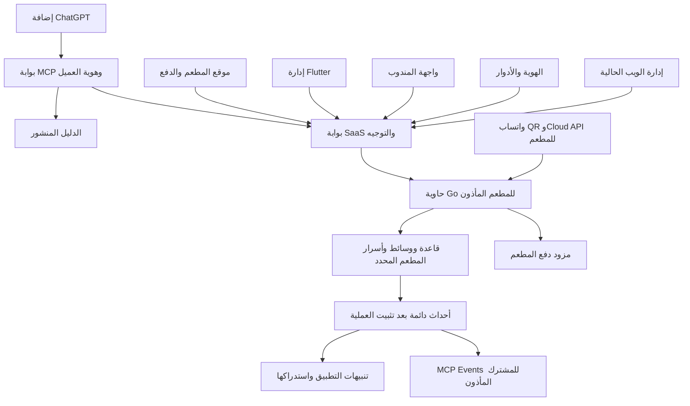

> Scope override, 2026-10-09: the owner removed all restaurant WhatsApp Business/QR,
> calling, translation and related conversation-archive requirements. Only restaurant
> and ChatGPT ordering remain active. Any older WhatsApp requirement below is historical
> and cancelled; other safety, commerce and launch requirements remain. Restore tag:
> before-whatsapp-removal-20261009. See README.md for the current runtime.

# مواصفات منصة المطاعم وخطة التحول إلى ChatGPT وFlutter

تاريخ التحديث: 30 سبتمبر 2026. الحالة: مواصفات وقرارات معتمدة من المالك، ونموذج اصطناعي محلي منفذ ومختبر، وبيئة اختبار محمية منشورة فعليًا على `https://almujeeb.info`، مع شروط إطلاق خارجية غير مغلقة؛ ليست إعلان اكتمال التحول أو قبول إنتاجي. الأدلة التفصيلية في [نتيجة النموذج](../prototype/README.ar.md) و[سجل بيئة الاختبار المنشورة](../prototype/staging/README.ar.md).

الهدف تطوير النظام الحالي إلى SaaS متعددة المطاعم مع الحفاظ على جميع وظائفه: موقع العملاء والقوالب الخمسة وإدارة الويب وواجهة المندوب، وواتساب بنوعَي QR وCloud API وما يتصل به من وظائف قائمة. تضاف قناة تسوق واحدة داخل ChatGPT وإدارة Flutter تبدأ بويندوز ثم Android وiOS. واتساب ميزة أساسية اختيارية لكل مطعم، يفعّلها المالك المخوّل أو يعطّلها؛ تبقى وظائفه محفوظة ويضاف Flutter إلى إدارة الويب. حماية بيانات العملاء والمطاعم وصحة المال والطلبات أولوية غير قابلة للتفاوض.

يعتمد هذا التحديث قرار المالك الأحدث بالإبقاء على جميع الميزات والتراخيص الحالية، ويلغي تعليمات إزالة واتساب وسحب إدارة الويب وإعادة ترخيص جميع المكونات كمنتج مغلق. النموذج المعزول في `prototype/` وفق [عقد النموذج](../prototype/CONTRACT.md) يستخدم مطعمين وهويات وبيانات اصطناعية، ولا يربط قواعد أو وسائط أو أسرار النظام الحالي أو أموالًا حقيقية. سُجلت نتيجة المرحلة المحلية الأولى منفصلة، ثم نُشرت بيئة HTTPS المحمية بأربع هويات اختبار محددة عبر Dex. نجاح النشر والدخول لا يعني قبول الإضافة في حساب ChatGPT أو اكتمال مراحل المنتج. يسجل [سجل شروط الإطلاق](SAAS-LAUNCH-GATES.ar.md) المتطلبات الخارجية المتبقية.

العمل الحالي على الخادم الموجود، ونطاق الاختبار المعتمد هو أصل `https://almujeeb.info` نفسه، دون نطاق فرعي. نقل الاستضافة إلى VPS سعودي مؤجل. طلب المالك صراحة عدم إنشاء backup أو snapshot في هذه المرحلة؛ لا تنشأ نسخة ملفات أو قواعد أو لقطة تلقائية باسم الاحتياط. يبقى اختبار النسخ والاستعادة شرط إنتاج ونقل بيانات حقيقية لاحقًا، ولا يعطل تجربة البيانات الاصطناعية الحالية. شراء الموارد أو إجراء دفع حقيقي أو تواصل تجاري ليس ضمن هذا التحديث.

### دليل التنفيذ والنشر الحالي

يسجل الجدول نتائج التنفيذ المبلّغ عنها في 30 سبتمبر 2026؛ كل نتيجة تخص نطاقها وبيئتها، ولا تجمع الأعداد لإعلان قبول شامل للمنتج. تفاصيل الإعداد وإعادة التحقق في [دليل staging](../prototype/staging/README.ar.md).

| النطاق | الدليل المنفذ | حد النتيجة |
| --- | --- | --- |
| أصل النطاق | HTTPS فعلي على `almujeeb.info` وCaddy نشط؛ لا fallback إلى النظام القديم | وجهة اختبار محمية، لا نقل لبيانات المطاعم أو نشر إنتاجي |
| هوية المختبرين | أربع هويات مسموحة فقط عبر Dex؛ نجح دخول الأربعة من المتصفح والتحقق الخادمي من الهوية | لا منتقي هويات اصطناعية عام؛ البيانات المرتبطة بالحسابات تظل اصطناعية |
| منصة النموذج | 87/87 اختبارًا ناجحًا مع PostgreSQL فعلي ودون تخطٍّ | اختبارات النموذج، لا إعادة اعتماد جميع اختبارات النظام الأصلي |
| إعدادات الرفض | 3/3 فحوص سلبية للإعداد ناجحة، منفصلة عن مجموعة المنصة | تثبت رفض الإعدادات المختبرة، لا صحة كل إعداد ممكن |
| المتصفح | 29 تحققًا بمتصفح مع محاكاة، و148 تحققًا بمتصفح على HTTPS الفعلي | يشمل الأخير أربع عمليات دخول Dex وطلبين وهميين مكتملين؛ ليس قبول حساب ChatGPT |
| ضوابط رحلة HTTPS | عزل العميل والتاجر، CSRF وخصائص cookie، تبديل إعداد القناة وتعارض نسخته ثم إعادته، والخروج ورفض إعادة الاستخدام | تبديل إعداد واتساب اصطناعي فقط؛ لا تفعيل QR أو Cloud API حي |
| أسرار Go والاعتمادات | 1/1 اختبار قراءة السر المركّب ناجح؛ فحص اعتماديات التشغيل أظهر صفر ثغرات معروفة في نطاقه وقت الفحص | لا يساوي ذلك اجتياز كل اختبارات Go أو شهادة أمن للبنية كلها |
| حفظ النظام الموجود | الحاويات القديمة بقيت سليمة وبنفس `StartedAt`، والمنفذ المحلي `18787` لم يتغير، والتراخيص الأصلية لم تتغير | دليل عدم إعادة تشغيلها أو استبدالها في هذا النشر، لا اختبار تكافؤ كامل لكل وظائفها |

لم تُنشأ نسخ احتياطية أو snapshots. لم يُقبل بعد الربط من حساب ChatGPT الفعلي أو MCP Events لديه، ولم تنفذ اختبارات ميسر الحقيقية أو بناء Windows. اختبار دورة التفويض الخارجية منفصل عن دخول Dex؛ لا يسجل نجاحه أو نجاح حساب ChatGPT قبل ورود دليله. جميع الطلبات والمبالغ والبيانات الحالية وهمية.

## القرارات المعتمدة ونطاق الإصدار الأول

| الموضوع | القرار المعتمد |
| --- | --- |
| النمو | 30 مطعمًا خلال الشهر الأول و1000 خلال السنة الأولى؛ عدد المطاعم ليس وحده مقياس الحمل |
| الاشتراك | 149 ريالًا شهريًا للمطعم أو 1188 ريالًا سنويًا تدفع سنويًا، بما يعادل 99 شهريًا، قبل الضريبة؛ لا عمولة منصة على الطلب |
| مصاريف منفصلة | رسوم بوابة الدفع والتوصيل والخدمات الخارجية والأجهزة ليست ضمن الاشتراك؛ لا وعد باستخدام خارجي غير محدود |
| مسار الأموال | ثمن الطلب إلى حساب بوابة المطعم مباشرة، واشتراك SaaS منفصل؛ لا تجميع أموال المطاعم في حساب المنصة |
| البوابة الأولى | ميسر؛ تبقى المحولات الأخرى موجودة لكن تفعيلها مشروط بقبول تقني وتعاقدي لكل مزود |
| الاستضافة | الخادم الحالي للاختبار الآن؛ VPS سعودي يديره المالك هدف إنتاج لاحق مؤجل، مع Docker لخدمات SaaS والمطاعم والتوسع بحسب القياس |
| العزل والتكلفة | نشر Docker مستقل لكل مطعم، وقاعدة ودور ووسائط وشبكة ورمز خدمة خاص به؛ صورة مطعم واحدة لكل إصدار وإعدادات مستقلة، دون تفرع كود لكل عميل |
| ميزانية البداية | تحدد بعد عرض VPS والنسخ السعودية المستقلة وقياس الحمل والتشغيل؛ تقدير الخدمات المُدارة السابق لا ينطبق على هذا الخيار، ولا وعد بخدمة 1000 مطعم على VPS واحد |
| قنوات التشغيل | ChatGPT وموقع العميل وإدارة الويب وواجهة المندوب وواتساب QR/Cloud API؛ Flutter قناة إدارة إضافية تبدأ بويندوز |
| واتساب | ميزة اختيارية باشتراك إضافي لكل مطعم وفق الاستحقاق، مع تحكم المالك المخوّل؛ لا يحدد هذا المستند سعرًا جديدًا أو يفترض أهلية حساب خارجي |
| البيانات والحقوق | تخزين بيانات الإنتاج التي نحتفظ بها نحن داخل السعودية؛ معالجة ChatGPT ونسخ المزود خارج الضمان. تبقى تراخيص AstraCalls وWaCalls والمكتبات والخطوط والبيانات كما هي مع الإشعارات والالتزامات اللازمة |
| الاختبار والنسخ | `https://almujeeb.info` على الخادم الحالي؛ بيانات ومبالغ اصطناعية فقط، ودون backup أو snapshot في المرحلة الحالية بطلب المالك |
| الاسم والهوية | الاسم والعلامة مؤجلان؛ نطاق الاختبار معروف وحساب المستخدم ChatGPT Pro، وتبقى هوية الناشر والتحقق والمراجعة متطلبات للنشر العام |

الاشتراك 149 ريالًا شهريًا أو 1188 سنويًا قرار تجاري معتمد للانطلاق، وتراجع استدامته بتكاليف البنية والنسخ والدعم المقاسة، دون تغيير السعر تلقائيًا. ليس ادعاء بأنه الأدنى في السوق أو ضمان ربحية. لا تعاد أسئلة مسار الأموال أو ملكية كود المالك التي أجاب عنها؛ المطلوب لاحقًا إثباتات الحسابات ونطاق عقود المعالجة والحقوق الخارجية.

## 1 الواقع الذي أثبته فحص الكود

| المجال | الموجود الآن | أثره على التحول |
| --- | --- | --- |
| البنية | Go وPostgreSQL وواجهة React وTypeScript | إعادة استخدام نواة المطعم والموقع، وكتابة إدارة Flutter |
| تعدد المطاعم | مطعم واحد لكل نشر، وكتالوج وحيد `id=1` | يلزم عزل وتوجيه وهوية مطاعم؛ تعدد جلسات واتساب ليس SaaS للمطاعم |
| الإدارة | مفتاح رئيسي مشترك `WACALLS_API_KEY` محفوظ في `localStorage` | هوية موظف وأدوار وجلسات قابلة للإبطال قبل الاستخدام المشترك |
| التشغيل | تهيئة WhatsApp وMeta والمكالمات قبل خدمات المطعم | فصل دورة حياة القنوات كي يعمل المطعم عند تعطيل واتساب مع إبقاء جميع وظائف القناة متاحة عند تفعيلها |
| المال | تسعير خادمي ومعاملات وإصدارات ومنع تكرار ومصالحة | الحفاظ على هذه القواعد عبر الواجهات الجديدة |
| الوسائط | صور المنيو تحت مجلد التسجيلات | فصل صلاحيات ومسارات الصور والتسجيلات تدريجيًا عند الحاجة دون حذف أيٍّ منها |
| الأسرار | تشفير إعدادات الدفع والإيصالات، ومفاتيحه في DB نفسها | فصل إدارة المفاتيح مع حفظ قابلية قراءة السجلات القديمة |
| البحث | ساعات عمل نصية ولا دليل مركزي للمطاعم | إضافة بيانات منظمة قبل عرض الفلاتر الجديدة |
| الواجهات الجديدة عند خط الأساس | لم يكن في التطبيق الحالي Flutter أو تكامل MCP/OAuth خاص بالمشروع | النموذج المعزول مأذون الآن؛ لا يثبت بمجرده اكتمال التكامل أو تكافؤ الإدارة |

الأدلة: [restaurant_store.go](../cmd/server/restaurant_store.go)، الأسطر 18 و49؛ [server.go](../cmd/server/server.go)، 59 إلى 94؛ [restaurant_http.go](../cmd/server/restaurant_http.go)، 179؛ [auth.ts](../client/src/lib/auth.ts)، 4 إلى 10؛ [restaurant_images.go](../cmd/server/restaurant_images.go)، 22؛ [restaurant_payments.go](../cmd/server/restaurant_payments.go)، 115؛ [restaurant_orders.go](../cmd/server/restaurant_orders.go)، 53 و99؛ [restaurant_types.go](../cmd/server/restaurant_types.go)، 32.

تغييرات كثيرة، ومنها ملفات المطعم، غير مثبتة في Git؛ خط البداية يراجع الملفات الحالية كاملة، وليس `HEAD` وحده، ويحفظها في مكانها دون reset أو حذف. ينفذ الحصر وقراءة الإصدارات دون إنشاء backup أو snapshot في هذه المرحلة. نتائج سبتمبر السابقة تخص بناء وبيئة سابقين، ولم تُعد اختبارات التطبيق الأصلي في هذه الدراسة. بعض اختبارات DB تتخطى دون قاعدة اختبار محددة، كما أن CI الحالي لا يجهز قاعدة المطعم ولا يشغل اختبارات عميل `npm test`؛ لذلك لا تكفي إشارة CI خضراء لإثبات سلامة التحول. راجع [اختبارات قاعدة المطعم](../cmd/server/restaurant_store_test.go) عند السطر 197 و[CI](../.github/workflows/ci.yml).

عند فحص خط الأساس لم يوجد Go أو Flutter أو Dart في PATH؛ كان Node وDocker متاحين. استخدمت بيئات معزولة لاختبارات النموذج اللاحقة، ولا يثبت ذلك وجود أدوات Windows أو اجتياز قبوله. لم يكن فحص خط الأساس قبولًا لحالة الإنتاج؛ فحص النشر اللاحق أثبت بقاء الحاويات القديمة سليمة وبنفس وقت بدء التشغيل، دون إعادة اعتماد كامل لوظائفها أو بياناتها.

## 2 نطاق المنتج ووظائف التكافؤ

النسخة الأولى للسعودية والريال السعودي، بالعربية والإنجليزية. تحتفظ كل منشأة بهويتها وإعداداتها وبياناتها. لا يتغير سعر طلب تاريخي أو نص منيو عند النقل.

| الوظيفة | المواصفة المحفوظة أو المضافة |
| --- | --- |
| المنيو | أقسام وأطباق وخيارات وإضافات وصور وأسعار وتوفر وترتيب وإصدارات تمنع ضياع التعديلات |
| الهوية | القوالب الخمسة `classic/bistro/editorial/compact/showcase`، ألوان وخطوط ومسودة ونشر ورجوع |
| الطلب | توصيل واستلام وطاولة، تسعير خادمي، لقطات المبلغ والضريبة والخيارات، سجل حالات ومنع تكرار |
| الطاولات | QR وروابط عشوائية، تعطيل وتغيير طاولة مأذون وطباعة |
| المخزون | حجز وتثبيت وتحرير واستهلاك، مع قواعد الإلغاء والتحضير وإعادة الفتح |
| العملاء | طلب ضيف على الموقع، حساب اختياري، عناوين محفوظة ووصول خاص للطلبات |
| التوصيل | مناطق ومدن وأحياء ورسوم، مندوبون وإسناد ومراحل تسليم وتحصيل وموقع اختياري |
| المال | سياسات النقد والدفع الإلكتروني، تمييز الاختبار والإنتاج، مصالحة واسترداد جزئي وكلي |
| خدمة الطلب | إلغاء وشكاوى وقرارات موثقة وسجل تسويات |
| الإدارة | إبقاء إدارة React وإضافة Flutter وموظفين وأدوار وأجهزة، مع قواعد وصلاحيات خادم واحدة |
| واتساب والاتصال | الحفاظ على QR وCloud API والجلسات والرسائل والمكالمات والترجمة والتسجيل وChatwoot والأرشيف والربط المساعد القائمة، مع عزل المطعم واستحقاق القناة |
| SaaS | تسجيل مطاعم وتفعيلها، عضويات ونطاقات واستحقاقات، دليل منشور ودعم وتشغيل وتدقيق |

أدلة التكافؤ: [AdminRestaurant.tsx](../client/src/restaurant/AdminRestaurant.tsx)، [restaurant_orders.go](../cmd/server/restaurant_orders.go)، [restaurant_stock.go](../cmd/server/restaurant_stock.go)، [restaurant_couriers_orders.go](../cmd/server/restaurant_couriers_orders.go)، [restaurant_brand.go](../cmd/server/restaurant_brand.go)، وملفات الإلغاء والاسترداد.

تبقى واجهات العملاء والإدارة `/admin` والمكالمات `/admin/calls` والمندوب `/courier` وظائف مستمرة، وتبقى القوالب الخمسة باللغتين. Flutter واجهة إدارة إضافية؛ لا يؤدي إطلاق Windows إلى تعطيل إدارة React أو تحويلها إلى مسار رجوع مؤقت. لا يعاد بناء موقع العملاء بـFlutter ضمن هذا النطاق. داخل ChatGPT نحافظ على الهوية والمحتوى مع تكييف التخطيط للمضيف؛ لا نفترض تطابقًا بكسليًا مع الموقع. تفصل [خريطة إعادة الاستخدام](SAAS-REUSE-MAP.ar.md) ما يبقى من النظام وما يضاف إليه، ولا يستبدل النموذج الاصطناعي نواة المطعم المكتملة.

نضيف منظمة مالكة وعضويات منذ البداية، ويمكن للمالك التبديل بين مطاعمه. تبقى وحدة المخزون والطلب والدفع مطعمًا واحدًا في الإصدار الأول، والسلة لمطعم واحد. الفروع ذات المخزون المشترك والسلة متعددة المطاعم توسعات مستقلة. Android ثم iOS مرحلتان لاحقتان بعد Windows.

## 3 قدرات الأطراف وحدودها المثبتة

| الطرف | القدرة الموثقة | ما سنبنيه وما يحتاج إثباتًا |
| --- | --- | --- |
| Plugin Extensions | تطبيق جانبي وواجهة بجوار المحادثة وروابط عميقة ونماذج | بحث ومنيو وسلة داخل ChatGPT؛ قبول على حسابات وواجهات المستخدم المستهدفة |
| MCP Apps | واجهة ويب معزولة وأدوات تعمل أيضًا دون UI | React خفيف للإضافة وإعادة استخدام مكونات مناسبة من الموقع |
| MCP | أدوات قراءة وكتابة على خادمنا | بوابة واحدة للعملاء، مع تفويض في نواة Go |
| MCP Events | اشتراكات يطلبها المستخدم وتوصيل Webhook | متابعة طلبات مملوكة، مستقلة عن تشغيل المطعم |
| OAuth | تفويض المستخدم عبر OAuth 2.1 | مزود هوية قائم، ورموز ونطاقات وملكية مفحوصة |
| الدفع | دفع خارجي متاح عمومًا؛ payment sheet لشركاء مختارين | موقعنا للدفع أولًا؛ لا افتراض قبول تجاري خاص |
| Flutter | Windows وAndroid وiOS، بأدوات بناء خاصة | Windows أولًا وقبول مستقل لكل منصة جوال |

تذكر [وثائق الامتدادات](https://developers.openai.com/plugins/build/extensions) أن امتدادات الويب لـFree وGo قادمة، وأن composer mentions للحاسوب فقط. توثق [صفحة Plugins](https://learn.chatgpt.com/docs/plugins) عمل الإضافات في Chat وWork على الواجهات المدعومة؛ لا يعني ذلك تطابق كل امتداد على كل جهاز. نكتشف القدرات ونوفر نتيجة نصية ورابط موقع عند غياب الواجهة. أساس الواجهة هو [MCP Apps](https://developers.openai.com/plugins/build/chatgpt-ui)، ولا نفترض صلاحيات متصفح كاملة داخل iframe.

يسمح مسار النشر الحالي بخادم MCP متصل واحد لكل إضافة، ويتطلب ناشرًا ونطاقًا موثقين ومراجعة؛ لذلك بوابتنا مركزية وتوجه داخليًا للمطاعم. لا نضمن الإدراج العام أو توصية ChatGPT التلقائية؛ البحث الذي نتحكم فيه هو البحث داخل منصتنا. المصدر: [تقديم الإضافة ونشرها](https://developers.openai.com/plugins/deploy/submission).

نختار الدفع الخارجي على نطاق معتمد. يذكر مرجع الدفع أيضًا وسائل محفوظة مسبقًا لدى التاجر دون جمع بيانات جديدة، لكن لا نعتمدها قبل التحقق من أهلية التكامل. نافذة ChatGPT الخاصة بالدفع ليست متاحة للجميع، وجمع بطاقة داخل iframe ليس بديلًا متاحًا لنشرنا. المصدر: [مرجع الدفع](https://developers.openai.com/plugins/build/monetization).

تبقى اشتراكات SaaS للمطاعم خارج إضافة التسوق، التي تبيع الطعام كسلع مادية. لا نمرر كلمات مرور أو بطاقة أو عنوانًا دقيقًا في أدوات النموذج؛ تفاصيل التسليم والدفع تدخل في الموقع الآمن، ويستخدم التكامل مراجع مبهمة عند الحاجة. تراعى حدود البيانات والموقع والأسعار الواردة في [إرشادات الإضافات](https://developers.openai.com/plugins/plugin-guidelines).

## 4 قرارات البنية المحسومة تقنيًا

1. الاحتفاظ بـGo وPostgreSQL ونواة المطعم الحالية، وتنظيم حدود الخدمات دون فقد وظائف. لا ننسخ القواعد المالية إلى Dart أو TypeScript. تحفظ تراخيص المكونات الحالية وفق قرار المالك وسجل القسم 13، دون تغيير شامل لها.
2. خدمة مطعم في حاوية Docker مستقلة، بقاعدة PostgreSQL ودور محدود ووحدات تخزين وشبكة داخلية ورمز خدمة خاص بالمطعم. يبدأ النموذج بقاعدتين وخدمتين مستقلتين وطبقة SaaS مركزية منفصلة. تستخدم المطاعم صورة واحدة لكل إصدار مثبت ببصمة، مع اختلاف الإعدادات والهوية والبيانات؛ لا مستودع أو تفرع كود لكل مطعم. يحدد قياس الموارد عدد المطاعم على المضيف السعودي قبل التوسع إلى مضيفين آخرين.
3. طبقة SaaS مركزية لسجل المطاعم والعضويات والنطاقات والاستحقاقات، بقاعدة وأسرار مستقلة. فهرس بحث مركزي للحقول المصرح بنشرها فقط؛ لا دفاتر عملاء أو طلبات في الفهرس. تنفذ تهيئة الحاويات والترقيات عبر مسار تشغيل موثوق منفصل عن API العامة؛ لا يربط `docker.sock` بخدمة SaaS أو MCP العامة.
4. `TenantRuntime` ثابت للمطعم داخل عمليته، يحدد قاعدته وأسراره ووسائطه ونطاقه. توجه البوابة الطلب لخدمة محددة مع فحص العضوية والملكية، وتعيد خدمة المطعم فحص التفويض. لا تغيير متغيرات بيئة مشتركة حسب الطلب، ولا قبول اتصال DB أو عنوان خدمة أو مفتاح يرسله العميل.
5. تطبيق Flutter واحد يخدم المطاعم حسب عضوية الموظف. القالب والهوية إعدادات، وليس إصدار تطبيق منفصلًا لكل مطعم.
6. بوابة MCP صغيرة بـTypeScript متصلة بخدمات Go. تثبت المرحلة الأولى توافق إصدارات SDK مع الامتدادات وMCP 2.0 وEvents؛ أمثلة التوثيق وحدها لا تثبت توافق الحزمة المثبتة.
7. API بإصدار وعقد موثق، مع نماذج TypeScript وDart مشتركة المصدر عند استقراره. فصل مسارات العملاء والإدارة والمندوب، وعدم استخدام مفتاح الإدارة للشراء.
8. معاملات DB وصندوق أحداث دائم يكتب في المعاملة نفسها. تكفي PostgreSQL وطوابير محدودة أولًا؛ لا نضيف بنية تشغيل موزعة أثقل دون حاجة مقاسة.
9. واتساب QR وCloud API وحدتا قناة معزولتان لكل مطعم، بإعدادات وجلسات وأسرار وطوابير وأحداث محددة الملكية. يبقى اختيارهما ووظائفهما في إدارة الويب، ويضاف التحكم المأذون في Flutter. تعطيل القناة لا يوقف API المطعم أو الموقع أو ChatGPT، ولا يمحو حساباتها أو سجلها تلقائيًا.

تكلفة هذا العزل مزيد من الحاويات والقواعد والترقيات والنسخ والاتصالات. نعالجها بتهيئة آلية موثوقة وسجل إصدار وترقيات متدرجة وحدود اتصالات وCPU وRAM ومساحة لكل مطعم. يقاس مجموع الاستهلاك قبل إضافة المطاعم؛ لا 1000 مجمع اتصالات كبير دائم ولا وعد بسعة 1000 مطعم على VPS واحد. تبقى عملية كتابة وعمال واحدة نشطة لكل مطعم أولًا، مع lease وانتقال ملكية مضبوط عند الحاجة؛ لا نعد بـactive-active. يمكن نقل نشر المطعم وبياناته إلى مضيف سعودي آخر دون تفرع الكود، ولا تنسخ آلية قفل واتساب العالمية كما هي.

الحاويات تشترك في نواة المضيف وموارده؛ تعطل VPS قد يوقف جميع خدماته، واختراق المضيف أو Docker قد يتجاوز حدود الحاويات. فصل العمليات والشبكات والبيانات يقلل العبور العارض ولا يساوي عزلًا ماديًا أو HA. تستخدم خدمات غير جذرية وصلاحيات دنيا وجذرًا للملفات للقراءة فقط حيث أمكن، مع عدم نشر منافذ قواعد البيانات أو إدارة Docker للعامة. تراجع شبكات التوجيه حتى لا يسمح اتصال البوابة بعدة مطاعم باتصال مطعم بقاعدة غيره.

المشاركة تخص سقف الموارد، لا هوية الاتصال: يرتبط كل مجمع واتصال فعلي بقاعدة المطعم ودور تشغيله محدود الصلاحيات. لا يعاد توجيه اتصال حي إلى مطعم آخر بتغيير `SET ROLE` أو `search_path`، ولا يستخدم دور شامل لكل المطاعم. تسحب منح `PUBLIC` الافتراضية التي تسمح بالاتصال بقواعد الآخرين أو إنشاء كائنات غير مأذونة، ويختبر الرفض بدور المطعم نفسه لا على مستوى HTTP فقط. تمنح خدمة التهيئة وحدها الصلاحيات الأوسع اللازمة للمهاجرات.

### الاستضافة والإقامة والتعافي

لإنتاج لاحق يشتري المالك VPS لدى مزود يثبت موقع التخزين داخل السعودية، ثم يشغل عليه Docker وخدمات PostgreSQL والموقع وSaaS وMCP وقنوات واتساب المعزولة. نقل الاستضافة مؤجل؛ يستمر العمل الاصطناعي على الخادم الحالي وعلى `https://almujeeb.info` دون نطاق فرعي. لا يفترض القرار خدمات مُدارة أو HA أو عقد سيادة إضافيًا. تختار مواصفات CPU وRAM والقرص والشبكة من القياس، وتبقى توسعة المضيف أو إضافة مضيفين قرار سعة لاحقًا. لا ينطبق تقدير تكلفة الخدمات المُدارة السابق على هذا التصميم.

نطاق الإقامة الذي حدده المالك هو بياناتنا المخزنة: قواعد العملاء والمطاعم والمنصة، الملفات والصور، سجلات التطبيق والتدقيق والمراقبة، ملفات التصدير والمؤقتات المحتوية بيانات، والنسخ الاحتياطية ومواد استعادتها. تحفظ هذه الفئات على تخزين سعودي محدد، بما فيه نسخ مزود VPS التلقائية إذا استخدمت. تفصل الملفات العامة والخاصة؛ صورة منيو منشورة لا تمنح قراءة إيصال أو بيانات عميل. لا توجه السجلات أو النسخ تلقائيًا إلى خدمة تخزين خارج السعودية.

معالجة ChatGPT وموقع تخزينه، والنسخ التي تنشئها OpenAI أو بوابات الدفع ضمن خدماتها، خارج ضمان استضافتنا؛ لا نشترط لها موقعًا سعوديًا أو اتفاق OpenAI سعوديًا خاصًا. يسجل تدفق البيانات الخارجي في إفصاح الخصوصية ويقلل إلى اللازم. هذا التحديد لا يغير واجبات الأمن والحقوق والشروط النظامية المنطبقة.

يتحمل المالك وفريق تشغيله تحديث النظام وDocker وPostgreSQL والصور، إدارة الثغرات والشهادات والأسرار، المراقبة والتنبيهات والسعة، والنسخ وتجارب الاستعادة والاستجابة للحوادث. تعالج حسابات الإدارة بمصادقة قوية وصلاحيات محدودة. لا تعرض قواعد البيانات أو لوحة إدارة Docker أو مقبسها عبر خدمة SaaS العامة، ولا يمنح تطبيق المطعم قدرة إدارة المضيف.

قبل استقبال بيانات إنتاج أو نقلها، يتطلب التعافي نسخة مشفرة مستقلة عن قرص VPS وحسابه التشغيلي، في وجهة سعودية ثانية مع صلاحيات منفصلة ومادة فك تشفير قابلة للاستعادة. تختبر استعادة PostgreSQL والملفات والمفاتيح إلى مضيف سعودي نظيف؛ snapshot على المضيف نفسه لا تحقق هذا الشرط. هذا شرط إنتاج لاحق؛ طلب المالك عدم تنفيذ backup أو snapshot الآن. لا تحويل تلقائي لتخزين بيانات الإنتاج خارج السعودية، ولا ادعاء تحمل فقد المضيف أو الموقع قبل اختبار المسار المستقل.

استرجاع مطعم واحد يتم في قاعدة ووحدات تخزين مؤقتة مستقلة ثم يغير توجيه المطعم بعد المصالحة، دون استبدال بيانات بقية المطاعم. يعاد فرض سياسة النسخ والصلاحيات وموقع التخزين قبل تقديم الخدمة. تحدد وتختبر نسخ PostgreSQL وأرشفة سجل المعاملات اللازمة إذا اعتمد هدف PITR؛ لا يعد توفره أو زمن التعافي محققًا لمجرد وجود Docker.

### اختبار ChatGPT على النطاق المعتمد

الوجهة المنشورة هي `https://almujeeb.info` على الخادم الحالي، وحساب المالك ChatGPT Pro. يعمل Caddy على أصل النطاق ويوجه إلى بيئة الاختبار وحدها دون fallback إلى النظام القديم؛ راجعت اختبارات HTTPS الدخول والعزل وCSRF والجلسات على هذا الأصل. لا تعني هذه النتيجة إتاحة Extensions أو Events أو قبول النشر تلقائيًا؛ تبقى التجربة الفعلية في الحساب مطلوبة.

أغلق منتقي الهويات ومسار `/dev/session` غير المحمي في الوجهة العامة، واستبدلا بدخول Dex لأربع هويات اختبار مسموحة ترتبط بسجلات اصطناعية خادميًا، مع PKCE وروابط عودة محددة وصلاحيات ضيقة. نجح الدخول الفعلي للأربعة؛ لا يساوي ذلك قبول دورة التفويض الخارجية من حساب ChatGPT. تبقى أدوات المعالجة والاشتراكات ومواقع الدفع وهمية ومعلنة؛ لا بطاقات أو أسماء أو عناوين عملاء حقيقيين. عدم توجيه النطاق إلى النظام القديم ليس حذفًا لواجهاته أو قنواته؛ بقيت خدماته الحالية دون إعادة تشغيل.

## 5 رحلة العميل وعقد أدوات الشراء

يختار العميل مطعمًا أو يبحث بين المطاعم المنشورة. تشمل الفلاتر اسم المطعم والطبق ونوع المطبخ ونطاق السعر ونمط الخدمة. يتطلب «مفتوح الآن» ساعات منظمة ومنطقة زمنية وإغلاقات استثنائية؛ القيمة النصية الحالية لا تكفي. نطاق الخدمة يختار عبر واجهة مضبوطة أو مرجع موقع مأذون، دون طلب إحداثيات العميل الدقيقة من النموذج.

حقول جديدة: `tenant_id` و`organization_id` و`public_slug` وحالة النشر، نوع المطبخ، ساعات أسبوعية بتوقيت `Asia/Riyadh` واستثناءات، وأساس واضح لنطاق السعر والتغطية. لا تعرض تقييمات أو سعرات أو ضمانات حساسية أو ETA دون بيانات موثوقة. الفهرس قد يتأخر؛ السعر والمخزون والتغطية يعاد فحصها عند الشراء.

عقد أدوات المنتج المستهدف؛ يثبت تقرير النموذج ما نُفذ واختُبر منه محليًا، ولا يفترض الجدول اكتمال جميع الأدوات أو قبولها إنتاجيًا:

| الأداة | الأثر والحدود |
| --- | --- |
| `search_restaurants` | قراءة دليل عام بفلاتر وصفحات محدودة |
| `get_restaurant_menu` | منيو منشور ونسخته دون إعدادات الإدارة |
| `quote_cart` | معاينة حسابية دون طلب أو حجز أو تحصيل |
| `prepare_checkout` | إنشاء جلسة سلة قصيرة العمر لمستخدم مصادق عليه؛ كتابة دون تحصيل أو تحضير |
| `get_order_status` | حالة طلب يملكه العميل؛ الرقم وحده لا يمنح الوصول |
| `request_order_cancellation` | طلب إلغاء بتأكيد؛ يوضح أثره المحتمل على الاسترداد |
| `create_order_complaint` | شكوى محدودة مرتبطة بطلب مملوك |
| `get_my_orders` | قائمة مقتصدة وصفحات، دون تحميل سجل شامل تلقائيًا |

الأعمال المعروضة للنموذج مسماة ومحددة المخططات والنتائج والنطاقات وتعليقات السلامة. لا executor عام أو SQL أو HTTP اعتباطي. أدوات الإدارة والمخزون والاسترداد المالي اليدوي لا تعرض في إضافة العميل.

رحلة الشراء الأولى:

1. يختار العميل العناصر، ويحسب الخادم المعاينة. رسوم التوصيل ليست نهائية قبل التحقق من الوجهة.
2. ينشئ الخادم جلسة Checkout مرتبطة بالعميل والمطعم والسلة والعملة والنسخة والانتهاء.
3. تفتح صفحة نطاق معتمد برمز انتقال محدود الغرض والمدة، لا يمنح الحساب أو قراءة الطلبات. GET لا ينفذ شراء، ولا يقبل عنوان redirect اعتباطيًا.
4. تثبت الصفحة السعودية ملكية الجلسة، وتجمع الاسم والهاتف والعنوان عند الحاجة؛ تعرض الإجمالي وتطلب تأكيده. تدخل البطاقة في صفحة ميسر المستضافة، لا في خادمنا أو حقول MCP أو Flutter.
5. يعاد فحص السعر والمخزون والتغطية، ويسجل الطلب والحجز بمفتاح تكرار ثابت. تغير السعر يعيد عرض المبلغ للتأكيد.
6. ينفذ مزود المطعم الدفع؛ العودة من المتصفح ليست إثبات تحصيل. يعتمد الخادم إشعارًا متحققًا منه أو استعلامًا مطابقًا للمبلغ والعملة والمرجع.
7. تظهر النتيجة والمتابعة في الموقع وChatGPT بعد قبول التكامل الحقيقي والتفويض وضوابط الخصوصية. الاشتراك بالأحداث اختياري وبطلب العميل؛ حتى المرجع المستعار وحالة طلب حقيقي بيانات قابلة للربط، وليسا ضمان إخفاء هوية. يوضح الإفصاح أن بيانات التكامل التي تصل ChatGPT تخضع لشروطه خارج ضمان إقامة تخزيننا السعودي.

المراجع الخارجية للطلب مبهمة أو تشمل المطعم مع الرقم؛ فقد تتكرر أرقام الطلبات بين قواعد مستوردة. لا تعاد حسابات الطلبات التاريخية. لا تحتاج هذه الرحلة مفتاح OpenAI من المطعم أو العميل، أو استدعاء نموذج من خادمنا لتسعير/تنفيذ الطلب. أهلية المستخدم لخطة ChatGPT وحصصها منفصلة، ولا نفترض المجانية.

## 6 الأحداث والموثوقية

يتطلب [MCP Events](https://developers.openai.com/plugins/build/mcp-events) بروتوكول MCP 2.0 بإصدار `2026-07-28`، وطرق `events/list` و`events/subscribe` و`events/unsubscribe`، وWebhook مع تحقق callback وتوقيع Standard Webhooks. polling وstreaming غير مدعومين لهذا المسار. المعالجة غير متزامنة وقد تصل الأحداث خارج ترتيبها؛ `2xx` ليس دليلًا أن العميل شاهد الإشعار. الحد الموثق للرسالة 256 KiB.

تصميمنا للأحداث:

- `order.status_changed` أولًا، ثم حالات الدفع والاسترداد. الحمولة مرجع مبهم وحالة ونسخة ووقت تغير؛ دون هاتف أو عنوان أو إحداثيات مندوب أو محادثة.
- الاشتراك مربوط بالعميل والمطعم والطلب، مع تحقق ملكية عند الاشتراك والإرسال. لا فلتر فارغ يفتح كل الطلبات.
- حفظ دائم وانتهاء وتجديد وإلغاء، وسر توقيع مشفر. تنتهي متابعة الطلب الطرفي بعد نافذة محددة، وتفصل متابعة الاسترداد المفتوح إذا لزم.
- outbox بعد commit، ومعرف ثابت للمحاولات وتوقيع جديد، وتراجع زمني وحدود إعادة محاولة وصندوق فشل. تتوقف إعادة الإرسال للأخطاء غير القابلة للمحاولة، ومنها `410` و`413` بحسب عقد المضيف.
- تحقق HTTPS وعناوين الوجهة عند الاتصال لمنع SSRF وDNS rebinding، ومنع الشبكات الداخلية وإعادة التوجيه، بما فيه اختبار callback.
- لا يؤدي وصول الحدث إلى تحصيل أو استرداد جديد. تقرأ الحالة الحالية عند الشك في نسخة قديمة.
- يستقبل Flutter أحداث التشغيل من خادمنا مباشرة مع cursor وإعادة اتصال واستدراك؛ لا نموذج ولا انتظار ChatGPT. يبقى الموقع قناة متابعة بديلة.

لا وعد بزمن وصول مضمون أو push على كل جهاز أو خلفية غير محدودة في ChatGPT. تختبر إتاحة الحساب والحصص والزمن عمليًا. تعطل Events لا يلغي طلبًا مدفوعًا ولا يمنع تحضيره وتسليمه.

## 7 الأمن والهوية وعزل البيانات

ربط ChatGPT عبر OAuth 2.1 وPKCE ومزود هوية قائم، وفحص issuer وaudience والانتهاء والنطاقات في كل طلب. المفتاح الرئيسي الحالي ليس بديلًا. يمكن إضافة mTLS لتعريف عميل OpenAI في مسار النشر المناسب، ولا يحل محل هوية المستخدم. المرجع: [مصادقة MCP](https://developers.openai.com/plugins/build/auth).

الضوابط المطلوبة:

- هوية عميل مركزية بالحد الأدنى وربط منفصل بسجله لدى كل مطعم؛ لا يرى المطعم مشتريات العميل لدى غيره. لا دمج بسبب الهاتف أو الاسم أو اسم مستخدم متطابق.
- تبقى إيصالات الضيوف القديمة صالحة وفق صلاحياتها. ربطها بحساب جديد يتطلب إثباتًا وموافقة، لا رقم الطلب فقط.
- أدوار أولية: مالك ومدير وموظف طلبات ومطبخ ومحاسب ومندوب. رؤية بيانات الاتصال والمال حسب الحاجة. دعم المنصة بوصول مؤقت مسجل.
- دخول الموظف عبر متصفح النظام وPKCE، ورموز قصيرة وتجديد وإبطال. MFA لمالك المطعم وحسابات المنصة والأعمال الإدارية الحساسة، مع استعادة مضبوطة.
- لا مفاتيح إدارة أو دفع أو DB في Flutter أو JavaScript أو حزمة الإضافة. يحفظ رمز الجهاز في مخزن نظام التشغيل الآمن.
- هوية المطعم في URL أو الأداة اختيار مورد فقط؛ يتحقق الخادم من العضوية/النشر وملكية السجل. لا يقبل `customer_id` أو `actor` أو `paid` من العميل كسلطة.
- سياق `TenantRuntime` ودور DB محدودان بمطعم واحد داخل خدمته، دون CREATE/DROP DATABASE؛ تحتفظ البوابة بتوجيه موثوق ورمز خدمة منفصل لكل مطعم دون تبديل سياق طلب قائم. التهيئة والمهاجرات بحساب تشغيل منفصل لا يصل إليه API العام، ولا يربط `docker.sock` بخدمات الجمهور. العزل يشمل الشبكات والكاش والطوابير والوسائط والنسخ والتصدير أيضًا.
- مفاتيح تشفير خارج DB، بإصدار وتغليف وتدوير. حفظ مفاتيح الإيصالات القديمة حتى إعادة تغليفها والتحقق؛ لا إعادة توليد تعطل وصول العملاء.
- حماية CSRF وCORS والنطاقات ورفع الصور وحدود المعدل. مراجعة الثقة بالوكيل الحالي؛ لا تعامل كل شبكة خاصة كوكيل مأذون.
- تقليل PII وتنقيح السجلات، وسجل تدقيق منفصل للفاعل والصلاحية والعملية. لا بيانات بطاقة أو أسرار أو نص محادثة خام في السجلات العامة.
- نصوص المنيو والشكاوى بيانات غير موثوقة وليست تعليمات. التفويض والمال والتأكيد لا يعتمد أي منها على قرار النموذج.

هذه ضوابط تصميم واختبار، وليست شهادة أمن للنسخة الحالية. تتوافق مع مبادئ [أمن الإضافات](https://developers.openai.com/plugins/guides/security-privacy). تعتمد سياسة احتفاظ قبل الإنتاج لفئات الطلب والمال والموقع والسجلات والاشتراكات والنسخ، وتشمل التصدير والحذف والتعليق القانوني. لا نعد بحذف نسخ لدى ChatGPT أو مزود خارجي لا نتحكم به. إثبات تخزيننا السعودي وقبول العقود والخصوصية شرط إطلاق؛ هذه الدراسة لا تثبت امتثالًا قانونيًا أو ضريبيًا.

حد الإقامة المعتمد يخص ما نخزنه نحن داخل السعودية. أوضح المالك صراحة أن معالجة ChatGPT وموقعه غير مشروطين بالسعودية؛ لذلك لا يوجد حاجب إطلاق ينتظر عقد OpenAI سعوديًا. يوضح إفصاح الخصوصية الفرق بين تخزيننا ونسخ المزود، ولا تنسب إعدادات API أو حساب Enterprise للمالك إلى جمهور الإضافة العام. يستمر منع الأسرار والبطاقات والعناوين الدقيقة غير اللازمة من أدوات النموذج، والتحقق من الملكية والاشتراك والإلغاء. أثبتت بيئة الاختبار المنشورة الدخول المقيد وضوابط عزل مختبرة، لكنها تبقى اصطناعية إلى قبول الحساب الفعلي والدفع والتخزين والتشغيل الإنتاجي؛ ليس السبب شرط إقامة ChatGPT. المصادر المرجعية: [ضوابط الإضافات](https://learn.chatgpt.com/docs/enterprise/apps-and-connectors) و[أمن ChatGPT Work](https://learn.chatgpt.com/docs/enterprise/chatgpt-work-cloud-security).

## 8 مواصفات إدارة Flutter

شاشة العمل: المطعم المأذون، حالة الاتصال، الطلبات والتنبيهات، ثم المنيو والطاولات والمخزون والمندوبون والدفع والاسترداد والإعدادات والهوية. تتضح هوية الفاعل وتعارض النسخ والأخطاء؛ لا نجاح قبل تثبيت الخادم.

- تطبيق يعتمد الاتصال أولًا. تخزين محلي مقتصد ومشفر عند وجود بيانات حساسة، مع وقت آخر تحديث. عند الانقطاع قراءة محدودة؛ لا قبول طلب أو كتابة مال ومخزون.
- عند فقد رد، استعلام عن النتيجة أو إعادة نفس مفتاح العملية. تسجيل الخروج يبطل الجلسة وينظف البيانات الحساسة.
- طبقة API وهوية وسمات منفصلة، وتصميم متجاوب وRTL/LTR ودعم لوحة المفاتيح.
- تنبيهات مباشرة ومؤشر اتصال. إغلاق التطبيق أو نوم الجهاز لا يضمن صوتًا أو تنبيهًا؛ يختبر سلوك الخلفية قبل الوعد بالتشغيل الدائم.
- طباعة النظام وPDF وQR أولًا مع اختبار العربية. ESC/POS والطباعة الصامتة تحتاج طابعات محددة وقبولًا فعليًا.
- تثبيت Windows موقّع وتحديث متحقق التوقيع ورجوع، دون صلاحيات مسؤول نظام للاستخدام اليومي.

بناء Windows يحتاج أدوات Windows وVisual Studio مع C++ وفق [وثائق Flutter](https://docs.flutter.dev/platform-integration/windows/setup). iOS يحتاج macOS وXcode وإعداد Apple وفق [دليل الإصدار](https://docs.flutter.dev/deployment/ios). مشاركة Dart لا تغني عن اختبار التخزين والتنبيهات والطباعة والأذونات لكل نظام.

## 9 الحدود التجارية والتكاملات الحالية

توجد محولات ميسر وTap وPayTabs وGeidea وMyFatoorah وStripe وHyperPay، وليست كلها مقبولة إنتاجيًا بهذه الدراسة. HyperPay اختبار فقط في [restaurant_payments.go](../cmd/server/restaurant_payments.go)، السطر 335. يبدأ الإطلاق بميسر على حساب مستقل لكل مطعم ثم تفعّل البدائل المدعومة بعد قبول الدفع والخصوصية والعقد؛ بوابة جديدة غير مدعومة تحتاج محولًا، لا إدخال اسم فقط. تحفظ السجلات التاريخية لكل مزود. اشتراك SaaS منفصل عن حساب تحصيل طلبات المطعم.

الاسترداد التلقائي منفذ لـStripe وTap وPayTabs وMyFatoorah، وتوجد تسويات يدوية للآخرين. الحل اليدوي لا يسمى استردادًا مؤكدًا، والعملية المالية المبهمة لا تعاد قبل المصالحة. الأدلة: [restaurant_refund_gateways.go](../cmd/server/restaurant_refund_gateways.go) و[تقرير الاسترداد](../RESTAURANT-REFUNDS-QA.md).

يدعم ميسر [استرداد الدفعة](https://docs.moyasar.com/api/payments/05-refund-payment) عبر API، لكن تفعيله في منتجنا يحتاج ربط الفاتورة بمعرف الدفع المحصل وإثبات نسبة الاسترداد إلى العملية المقصودة، خصوصًا عند غموض الرد أو استرداد خارجي متزامن. لا نعمم ضمان `given_id` الخاص بإنشاء الدفع على الفواتير أو الاستردادات. يبقى الاسترداد الآلي مغلقًا عند عدم ثبوت الإسناد؛ التسوية اليدوية مسار واضح موثق وليست نجاحًا آليًا. سياسة ميسر المنشورة تنص على إقامة البيانات الشخصية في السعودية؛ قبول نطاق العقد والحساب منفصل عن وجود هذا التصريح العام. التفاصيل في سجل شروط الإطلاق.

سياسات طرق الدفع الحالية محفوظة: التوصيل بطاقة أو نقد عند التسليم، والاستلام بطاقة، والصالة بطاقة أو نقد وفق اختيار الدفع قبل/بعد. لا يثبت إشعار المتصفح السداد ولا يستطيع المندوب إثبات دفع بطاقة. المناديب حسابات ينشئها المطعم ويديرها ويسند إليها الطلبات؛ لا يوجد في المراجعة تكامل منفذ مع شركة توصيل خارجية. تبقى `/courier`، وموقع المندوب اختياري محدود العمر والوصول؛ لا تبث إحداثياته عبر MCP Events.

الدليل الجغرافي المحلي هو نسخة Lite من مستودع `homaily/Saudi-Arabia-Regions-Cities-and-Districts`، بالإصدار `7e322945fa9f6d696a54ba3e9038e0e750e9692d`؛ يضم 13 منطقة و4581 مدينة/تجمعًا و3732 حيًا. ينسب ناشره الجمع إلى خرائط العنوان الوطني ويحمل GPL-2.0، لكنه ليس تكامل سبل رسميًا ولا إثباتًا لحقوق المصدر الأصلي. لا تحتوي Lite حدودًا أو إحداثيات للأحياء. أدلة المصدر والبصمات في [المستورد](../cmd/server/restaurant_geography.go)، وشروط اعتماد المصدر موثقة في سجل الإطلاق.

دليل الجغرافيا مرجع عام منفصل عن بيانات العملاء، مع إبقاء تعديل أسماء الأحياء والتغطية والرسوم محليًا لكل مطعم. يحفظ خيار الرسم الموحد أو رسم الحي؛ الرسم الفارغ غير مهيأ، والصفر توصيل مجاني، والحي المعطل/غير المهيأ يرفض قبل الدفع. النطاق بالكيلومترات مسافة مباشرة لا طريق سيارة أو زمن وصول، واختيار حي أو كتابة عنوان مختصر ليس تحقق عنوان رسميًا. عند تغيير المصدر تربط المعرفات صراحة وتحفظ لقطات الطلبات القديمة. لا تتغير رسوم مطعم بسبب تصحيح محلي لدى مطعم آخر.

لا تدرج البيانات الخام في حزمة Flutter أو منتج موزع قبل حسم حقوق توزيعها؛ تستعمل التجربة بيانات اصطناعية أو مصدرًا مأذونًا. الفصل في خدمة لا يحسم وحده حقوق البيانات أو نتائج API، وحفظ تراخيص النظام لا يثبت حقوق ناشر دليل جغرافي خارجي. الإيصالات الحالية ليست إثبات فوترة إلكترونية معتمدًا؛ تبقى إيصالات طلب حتى تنفيذ المتطلبات المختصة.

## 10 مراحل التنفيذ وبوابات القبول

| المرحلة | المخرجات | شرط الانتقال |
| --- | --- | --- |
| 0 خط البداية | حصر المصدر والوظائف والإصدارات والتراخيص والروابط وخريطة إعادة الاستخدام، دون backup أو snapshot الآن | نطاق محفوظ دون حذف، وبيئة اصطناعية معزولة؛ خطة النسخ والاستعادة للإنتاج اللاحق |
| 1 إثبات الإمكانات | مطعمان اصطناعيان، واجهة بحث ChatGPT، OAuth، checkout خارجي، دورة اشتراك حدث، هيكل Flutter على Windows | نجاح على الحسابات والواجهات المستهدفة أو حد موثق ومسار بديل |
| 2 إعادة استخدام النواة | تنظيم حدود Go وAPI والوسائط والقنوات، مع إبقاء جميع وظائف المطعم وQR وCloud API | نفس قواعد الطلب والمال والقوالب والواجهات، وعمل المطعم عند تعطيل واتساب دون إزالة القناة |
| 3 تأسيس SaaS | سجل مطاعم وهوية وأدوار، ونشر Docker لكل مطعم بصورة موحدة، وقواعد وأسرار وشبكات ووسائط ونسخ وترقيات | اجتياز الوصول المتبادل المحظور عبر API وDB والشبكات وjobs وmedia وcache وEvents، دون منح API العام صلاحيات Docker |
| 4 قناة العميل | دليل وفلاتر، أدوات وواجهة، سلة وhandoff ومتابعة وإلغاء | رحلة طلب واحدة دون تكرار أو تسريب، والموقع يعمل مستقلًا |
| 5 إدارة Windows الإضافية | وظائف إدارة Flutter وأدوار وتنبيه وطباعة وتحديث، مع بقاء إدارة الويب | يوم عمل تجريبي على Windows ومصفوفة تكافؤ، وعدم فقد وظيفة ويب قائمة |
| 6 الأحداث والتشغيل | outbox وMCP Events واستدراك التطبيق ومراقبة ومصالحة ودعم | الانقطاع لا يفقد طلبًا أو يكرر مالًا، وفشل ChatGPT لا يوقف المطبخ |
| 7 التجربة والترحيل | نقل مطعم تجريبي، مطابقة واستعادة، قبول PSP، حزمة نشر الإضافة | قبول الأجهزة والمال والبيانات ومراجعة OpenAI اللازمة للإتاحة العامة |
| 8 تكامل القنوات والميزات | الويب وFlutter وChatGPT وواتساب QR/Cloud API مع استحقاق وتفعيل لكل مطعم | كل الوظائف الأصلية باقية؛ تعطيل قناة لا يفقد طلبًا أو يغير دفعًا ولا يعيد إرسال طابورها دون قصد |
| 9 الجوال | Android ثم iOS | قبول وتوقيع ونشر خاص بكل منصة |

إثبات التكامل في المرحلة 1 يسبق الاستثمار الواسع في الواجهات. بعد تثبيت API يمكن عمل ChatGPT وFlutter بالتوازي، مع منع بيانات حقيقية قبل قبول الهوية والعزل. إتمام التحول الأول يشمل 0 إلى 8؛ الجوال لاحق. لا موعد قطعي قبل إثبات التكامل ومعرفة حسابات النشر وبيئة Windows وحجم البيانات. نموذج عرض ليس بديلًا لقبول المال والترحيل والتشغيل.

أهداف تشغيل أولية للتجربة، وليست SLA تجارية: صفر فقد للطلبات المقبولة في النقل المخطط. يقاس زمن التعافي وفقد البيانات على VPS المختار ووجهة النسخ السعودية المستقلة قبل إعلان التزام؛ يبقى فقد لا يتجاوز خمس دقائق وعودة خلال ساعة هدفين تصميميين يحتاجان نسخًا وسجل معاملات ومسار استعادة يثبت تحقيقهما، ولا يعدهما VPS واحد أو Docker وحدهما. هدف الاستجابة لقراءات النواة أقل من ثانية عند المئين 95، وتنبيه Flutter المتصل أقل من ثلاث ثوان عند المئين 95، باستثناء تأخير PSP وChatGPT الخارجي.

افتراض حمل للتخطيط والاختبار اللاحق، لا توقع مبيعات ولا ضمان قدرة: 100 طلب لكل مطعم يوميًا خلال 12 ساعة، بذروة تبلغ عشرة أمثال المتوسط. ينتج ذلك 3000 طلب يوميًا لـ30 مطعمًا و100000 لـ1000؛ نحضر اختبارات تدريجية بنحو 1 ثم 25 طلبًا جديدًا في الثانية، و20 ثم 500 قراءة في الثانية بافتراض 20 قراءة لكل طلب وتقريب الحدود إلى الأعلى. يبدأ إثبات الوظيفة بمطعمين فقط؛ حمل التوسع يختبر لاحقًا ببيانات مولدة ومجموعات موارد مضبوطة، لا كل مرة يغير فيها نص أو واجهة. تستبدل هذه الافتراضات بقياسات التجربة قبل شراء سعة أكبر أو إعلان وعد أداء.

### معايير قبول الإصدار الأول

كل معيار أدناه شرط قبول كامل للإصدار، وليس كله مغلقًا بنتائج النموذج. توجد أدلة جزئية منفذة للهوية والعزل ورحلة الطلب وإعداد القناة في جدول التنفيذ أعلاه؛ يسجل دليل الاختبار ونسخة البناء وبيئة التنفيذ قبل إعلان إغلاق المعيار بكامله. لا تعد المحاكاة أو نجاح دخول Dex دليلًا بديلًا عن اختبار حساب ChatGPT أو Windows أو الدفع المطلوب.

| الرمز | معيار القبول | الدليل المطلوب |
| --- | --- | --- |
| A01 | لا عبور بين مطعمين في الطلب أو الدفع أو الملف أو الكاش أو العامل أو الحدث | اختبارات رفض بمعرفات متشابهة وأدوار مختلفة، مع فحص دور DB والتوجيه |
| A02 | نواة المطعم تعمل عند تعطيل واتساب، وتبقى وظائف QR وCloud API الحالية متاحة للمطعم المأذون عند تفعيلها | اختبار التفعيل والتعطيل والاستحقاق والعزل، مع حفظ الجلسات والوظائف ورفض تجاوز القناة من API أو عامل |
| A03 | الشراء خادمي مؤكد لا يكرر طلبًا أو حجزًا أو تحصيلًا | تغير سعر وآخر قطعة متزامنة وتكرار الطلب وعودة شبكة مبهمة |
| A04 | ميسر يحصّل لحساب المطعم الصحيح فقط | قبول SAR وبيئة الحساب والمبلغ ومرجع الفاتورة/الدفع، وفشل/انتهاء/دفع متأخر |
| A05 | استرداد ميسر لا يتجاوز الرصيد ولا ينسب نجاحًا مجهولًا إلى طلبنا | جزئي وكامل وتزامن خارجي وانقطاع ومصالحة؛ يظل الآلي مغلقًا إن تعذر الإثبات |
| A06 | الإضافة والامتداد يعملان على الحسابات والواجهات المستهدفة | تشغيل اصطناعي فعلي للبحث والمنيو والسلة وOAuth والدفع الخارجي، وتوثيق حدود العرض |
| A07 | MCP Events لا يسرب أو يضيع حالة بسبب تكرار أو ترتيب | اشتراك مأذون وإلغاء وتجديد وrestart وفشل توقيع وSSRF ومصالحة بالحالة الحالية |
| A08 | إدارة Windows تضيف وظائف المطعم المطلوبة دون سحب إدارة الويب | يوم عمل على Windows فعلي، RTL وصلاحيات وانقطاع وتنبيه وطباعة وتثبيت/تحديث موقّع، مع بقاء وظائف الويب الحالية |
| A09 | مناطق ورسوم ومناديب المطعم محفوظة | حي بلا رسم/معطل، رسم صفر، عدم عبور تصحيح محلي، إسناد ومراحل تسليم وCOD وتقييد الموقع |
| A10 | نقل يحفظ التاريخ ووسائطه ومفاتيحه | أعداد ومجاميع وبصمات وإيصالات/QR قديمة وخطة رجوع لا تمحو معاملات جديدة |
| A11 | استعادة مطعم لا تمس بقية المطاعم | استعادة لمثيل سعودي منفصل وإعادة فرض سياسات الإقامة والنسخ قبل تقديمه |
| A12 | تخزيننا السعودي والحقوق والإفصاح صالحة للتدفق المنشور | إغلاق البنود الحاجبة في سجل شروط الإطلاق، وإثبات مواقع DB والملفات والسجلات والنسخ؛ لا يشترط عقد إقامة سعودي لـOpenAI |
| A13 | التوسع ضمن حمل مصرح به وموارد معلومة | قياس p95 والاتصالات والمهل وحدود كل مجموعة والكلفة دون استنتاج حمل غير مختبر |
| A14 | موقع العميل والإدارة والمندوب وواتساب المفعّل مستقلون عن تعطل ChatGPT | طلب ومتابعة وتشغيل مطعم دون Events؛ لا تبديل قناة معطلة إلى مفعلة تلقائيًا |
| A15 | كل القوالب والوظائف الحالية محفوظة | مراجعة خريطة إعادة الاستخدام والقوالب الخمسة ar/en وواجهات العميل والإدارة والمندوب والمكالمات والتسجيل والترجمة وChatwoot والأرشيف حسب قدراتها الحالية |

دورة حياة المطعم: إنشاء ومراجعة هوية وصلاحيات وربط دفع، تجربة، نشر، ثم تعليق أو إغلاق وتصدير. تعطل الاشتراك التجاري يمنع نشاطًا جديدًا وفق السياسة دون حذف البيانات أو تعطيل تسوية الطلبات والاستردادات القائمة. تراقب المنصة زمن الطلبات وأخطاء الدخول وتأخر outbox وغموض الدفع وفشل النسخ واستهلاك موارد كل مطعم، مع إجراء استجابة للحوادث وإبطال جلسات وتدوير أسرار واستعادة معزولة. لا تضاف قراءة بيانات العملاء إلى صلاحية الدعم افتراضيًا.

## 11 حفظ الوظائف ودورة القنوات والنقل اللاحق

المرحلة الحالية تطوير واختبار اصطناعي على الخادم الموجود؛ لا backup أو snapshot ولا نقل بيانات إنتاج الآن بطلب المالك. البنود التالية تخص نقل بيانات حقيقية مستقبلًا عند بدء مرحلته، وليست إجراءات تنفذ أثناء تجربة النطاق الحالية.

1. تحديد المصدر وإصداره ونطاقه ووحدات تخزينه والعمليات المالية المعلقة؛ لا اعتماد على وصف إنتاج قديم.
2. حفظ المصدر الكامل والصورة والقواعد القديمة والوسائط ومادة فك التشفير بصورة مشفرة ومقيدة. لا أسرار أو بيانات عملاء داخل Git أو الحزم.
3. استعادة تجريبية معزولة، مع منع خروج اتصالات واتساب والدفع الحقيقي والإشعارات بالشبكة والاعتمادات، وليس زر واجهة فقط.
4. إسناد المطعم الحالي إلى tenant ثابت وحفظ الأرقام وUUIDs والإصدارات واللقطات المالية والمراجع الخارجية. عدم دمج عملاء آليًا.
5. نقل صور المنيو ببصمات وروابط متوافقة، وحفظ أسرار الإيصالات وQR. تغيير أسماء cookies والبيئة يحتاج توافقًا مضبوطًا أو إعادة دخول معلنة.
6. مهاجرات مضافة ومؤرخة، دون DROP في نافذة الرجوع. لا يستخدم `SessionManager.Restore` أو حذف جلسات كأداة ترحيل؛ بعض مساراته تسقط قواعدها فعلًا. تبقى استعادة الجلسات جزءًا من تشغيل القناة المأذون بعد مراجعة الحالة والعزل، لا أثناء فحص نسخة اختبارية.
7. نافذة صيانة محدودة لإيقاف الكتابة وتصريف العمليات. تخزن إشعارات الدفع الواردة بصورة دائمة خلال القطع وتسلّم للكاتب المختار بعده. تنقل آخر فروق البيانات وتفحص المجاميع والملكية ثم يغير التوجيه.
8. كاتب واحد وعمال مال ومخزون وأحداث في جهة واحدة لكل مطعم. القراءة التجريبية لا تتحول إلى كتابة مزدوجة. تبقى مسارات callbacks القديمة صالحة للمحاولات القائمة حتى تسويتها.
9. قبل كتابة جديدة يمكن الرجوع للمصدر المجمد. بعدها يرجع إصدار التطبيق المتوافق مع البيانات الحالية؛ إن تعذر، تجمد الكتابات وتصالَح الفروق قبل نقل عكسي. استعادة نسخة قديمة فوق طلبات جديدة ليست رجوعًا آمنًا.
10. بعد القبول تبقى جميع القنوات والواجهات والوظائف القائمة وفق الاستحقاق والصلاحيات. تنقل الجلسات والمحادثات والتسجيلات والأرشيف دون فقد وبسياسات الاحتفاظ والنزاعات المعتمدة، ولا تغذى ChatGPT بها تلقائيًا. لا يشمل إعادة التنظيم حذف ملفات أو ميزات أو بيانات موجودة.

تحفظ صور المنيو تحت recordings في [restaurant_images.go](../cmd/server/restaurant_images.go)، وتوجد مسارات إسقاط قواعد في [sessionmanager.go](../cmd/server/sessionmanager.go)، 132 إلى 158. لا تزال وحدة recordings بالجملة. تحفظ حالة تفعيل القناة لكل مطعم عبر الترقيات والرجوع؛ تشغيل صورة مختلفة لا يسمح بإعادة قناة معطلة أو إرسال طابور متوقف دون قصد.

نطاق الحفظ يشمل `internal/wa` و`internal/voip` والجلسات والرسائل والمكالمات وMeta والترجمة الصوتية والتسجيل وChatwoot وwidget وإضافة pairing، و`/admin/calls` وتبويبات واتساب والأرشيف والـcodecs وإعدادات الوسائط اللازمة. تبقى ترجمة واجهة المطعم ar/en والمنيو والطلبات والمخزون والقوالب الخمسة والتوصيل والدفع وإشعارات التراخيص. وجود QR وCloud API لا يثبت تماثل قدراتهما أو إنشاء طلب مطعم تلقائيًا من رسالة؛ يختبر الربط المطلوب فوق نواة الطلب دون اختلاق وظيفة غير منفذة. النسخ لدى Chatwoot أو أطراف خارجية لها دورة احتفاظ مستقلة.

قرار تفعيل واتساب يجمع استحقاق المطعم التجاري وإذن المالك المخوّل وحالة إعداد القناة. يفحص الخادم ذلك في API والعمال وwebhooks، مع تحقق توقيع المزود ونسبة الجلسة أو الرقم إلى المطعم. لا تتحول رسالة غير موثوقة إلى دفع أو طلب مؤكد دون القواعد الخادمية والتأكيد المطلوبين. لا تعطل قناة مطعم خدمة مطعم آخر.

عند التعطيل تمنع الطلبات والجلسات الصادرة والأعمال الجديدة عبر القناة، وتوقف طوابيرها عن تنفيذ إرسال جديد دون حذف محتواها أو اعتماد تسليم لم يقع. تعالج العمليات الجارية بسياسة إنهاء محددة ومسجلة، وتقبل إشعارات إثبات الحالة الضرورية دون فتح طلبات جديدة. تبقى الطلبات القائمة والمدفوعات والاستردادات قابلة للمتابعة من الويب وFlutter وChatGPT، ولا تلغى بسبب تعطيل واتساب. عند إعادة التفعيل تراجع صلاحية الوظائف المعلقة وتكرارها قبل استئنافها؛ حذف الحساب أو إبطال بيانات ربطه عملية منفصلة صريحة.

## 12 التحقق حسب المخاطر وترشيد التوكنز

الأسعار والتفويض والأنواع والمخططات تختبر بكود حتمي وقيود DB؛ لا يرسل كل طلب أو تحديث إلى نموذج. لا تفعّل ترجمة تلقائية للمنيو أو تلخيص أرشيف لمجرد إضافة ChatGPT؛ تبقى وظائف الترجمة والتلخيص القائمة وإعداداتها ضمن نطاق الحفظ وباختيار المستخدم المخوّل. تستهلك الواجهة والأحداث الحد الأدنى اللازم من سياق ChatGPT.

| التغيير | التحقق المطلوب |
| --- | --- |
| نص أو تنسيق بسيط | مراجعة موضعية وبناء/أنواع عند الحاجة، دون قبول شامل متكرر |
| نواة أو API | اختبارات الوحدات والمسارات التي يعبرها التغيير |
| هوية وعزل | مستأجران بمعرفات/أرقام متشابهة، ومالكون وأدوار مختلفة؛ اختبارات منع عبور لكل قناة حساسة |
| طلب ومخزون | آخر قطعة متزامنة، انتهاء حجز، تغير سعر، تكرار إرسال، سباق التحضير والإلغاء |
| دفع واسترداد | توقيع مزور/مكرر، مبلغ أو عملة خاطئان، غموض شبكة، دفع متأخر، منع تجاوز الاسترداد |
| MCP | OAuth وملكية، تأكيد صحيح، وصف منيو خبيث، نتائج زائدة، أدوات وصلاحيات محدودة |
| Events | تكرار وترتيب وتجديد وإلغاء وفقد إذن وrestart وSSRF وتعطل الاستقبال |
| واتساب والقوالب والويب | بقاء QR وCloud API ووظائف الاتصال والمحادثات الحالية، استحقاق وتفعيل لكل مطعم، سلامة الطلبات عند التعطيل، والقوالب الخمسة وواجهات العميل والإدارة والمندوب |
| Flutter | Windows فعلي وRTL وأدوار وانقطاع/استئناف وطباعة وتثبيت وتحديث |
| النقل | استعادة وأعداد ومجاميع وبصمات وملكية وروابط قديمة ورجوع يشمل الكتابات الجديدة |

تستخدم اختبارات PostgreSQL قاعدة معزولة مسموحة، وتفصل النتائج الناجحة عن المتخطاة. مرور شامل واحد للمرشح النهائي بعد استقرار المكونات، ثم إعادة الأجزاء المتأثرة بالإصلاح؛ يعاد الكل إذا أثر التغيير في حد مشترك واسع. لا يعاد اختبار الصوت أثناء تطوير ميزة مطعم معزولة، ولا تكتب اختبارات تعيد وصف تنفيذ بسيط فقط.

تختصر مخرجات الأدوات إلى الحالة والإخفاقات؛ لا قراءة متكررة لوثائق لم تتغير. نتائج البحث محدودة الصفحات، والأحداث موجزة مع دمج مناسب، والصور والتشخيص خارج سياق النموذج عند عدم الحاجة. لا يوفر التوكنز بحذف تحقق أمني أو مالي لازم، بل بإجراء الفحوص الحتمية خارج النموذج وإعادة استخدام الأدلة.

اختبار حساب ChatGPT الحقيقي وPSP الحقيقي اختبارا قبول صغيران ضروريان، ولا يغني عنهما mock. لا يكرران بلا تغيير مؤثر أو إخفاق جديد.

## 13 القرارات التجارية والمتطلبات الخارجية

| القرار | الاعتماد | الحالة |
| --- | --- | --- |
| تحصيل ثمن الطلب | إلى حساب كل مطعم مباشرة، واشتراك SaaS منفصل | وافق المالك |
| السعر والنمو | 149 شهريًا أو1188 سنويًا، 30 مطعمًا ثم1000 خلال السنة | وافق المالك |
| الاستضافة والإقامة | اختبار على الخادم الحالي؛ VPS سعودي وإقامة بيانات تخزيننا هدف إنتاج لاحق، ومعالجة ChatGPT ونسخ المزود خارج ضماننا | النقل مؤجل؛ لا شراء مطلوب لاستكمال الاختبار الحالي |
| الوظائف والواجهات | جميع الوظائف وQR وCloud API والقوالب الخمسة وإدارة الويب محفوظة؛ Flutter إضافي وواتساب قابل لتفعيل المالك | معتمد؛ يسجل دليل التكافؤ والتنفيذ دون ادعاء اكتماله |
| الملكية والتراخيص | ملكية المالك لتطويره محفوظة، وتبقى تراخيص الأطراف الحالية وإشعاراتها والتزاماتها دون تغيير | وافق المالك؛ لا إعادة طرح قرار الإبقاء على التراخيص أو فرض إعادة ترخيص مغلقة |
| البيانات الجغرافية | مكوّن خارجي مستقل محفوظ الترخيص، لا يندرج تحت تصريح ملكية كود المطعم | المصدر معروف؛ نطاق حقوق الاستخدام/العرض يحتاج إغلاقًا |
| الاختبار والهوية | أصل `almujeeb.info` على الخادم الحالي وحساب ChatGPT Pro، دون نطاق فرعي أو backup/snapshot في هذه المرحلة | نشر HTTPS ودخول أربعة مختبرين مثبتان؛ قبول حساب ChatGPT والنشر العام معلق، والعلامة التجارية مؤجلة |

اعتمد المالك إبقاء [LICENSE](../LICENSE) الخاص بـAstraCalls ‏(AGPL-3.0) و[LICENSE.WaCalls](../LICENSE.WaCalls) ‏(MIT) وإشعارات المكتبات والخطوط والبيانات كما هي. لا تعدل هذه الوثيقة تلك الملفات ولا تعيد ترخيص الشيفرة كلها كملكية مغلقة. يعد سجل منشأ للمكونات المستخدمة، وتحفظ نسبة المصدر ونصوص الترخيص وتنفذ التزامات إتاحة المصدر المقابل حيث تنطبق، دون إدراج أسرار أو بيانات عملاء. لا يسقط وضع واتساب في خدمة مستقلة التزامات ترخيصه تلقائيًا، ولا يعاد التشكيك في تصريح المالك عن تطويره. يفرق [مرجع GNU](https://www.gnu.org/licenses/gpl-faq.html.en#UnreleasedMods) بين تشغيل GPL دون توزيع وشرط AGPL الشبكي؛ تبقى حقوق مصدر الجغرافيا مسألة مستقلة موثقة.

المتطلبات الحالية المتبقية: إثبات الربط والواجهة والتفويض وEvents في حساب ChatGPT Pro؛ أُنجز نشر HTTPS والتوجيه على `almujeeb.info` والدخول المقيد للمختبرين. المتطلبات في مراحلها اللاحقة: VPS سعودي ووجهة نسخ مستقلة قبل الإنتاج، حساب ميسر التجريبي ثم أهلية كل تاجر، إعداد واختبار QR/Cloud API للمطعم الذي يفعّلها، Windows وشهادة توقيع، ومصدر جغرافيا مأذون. لا يطلب حساب CNTXT أو اتفاق OpenAI سعودي خاص، ولا تنفذ نسخ احتياطية الآن. لا تطلب كلمات المرور والمفاتيح أو هوية العملاء في المحادثة؛ تستخدم قنوات إعداد محمية.

سجل قبول الإطلاق المطلوب: مصدر محفوظ، اختبارات عزل ومال، نسخة استعيدت، تجربة ChatGPT فعلية، قبول Windows، قبول دفع مضبوط، مراجعة نشر لازمة، وخطة رجوع جُرّبت. أي خانة دون دليل تبقى غير مكتملة صراحة.

الحالة الحالية: النموذج المحلي الأول موثق في [تقريره](../prototype/README.ar.md)، وبيئة الاختبار المحمية منشورة فعليًا على أصل النطاق مع دليل [staging](../prototype/staging/README.ar.md) ونتائج الاختبارات أعلاه. نجح دخول Dex بهويات مسموحة، لكن الدفع محاكاة، وحساب ChatGPT وEvents وميسر الحقيقي وWindows غير مقبولة بعد. بقيت الحاويات القديمة والتراخيص دون تغيير، ولا يشمل النطاق حذف واتساب أو سحب إدارة الويب. لم تنفذ نسخة احتياطية أو snapshot؛ قبول الحسابات والمال ونقل الإنتاج شروط لاحقة مستقلة.

## إضافة مؤجلة: تكامل POS — قرار المالك في 5 أكتوبر 2026

أثناء المكالمة طلب المالك الاستمرار في مسار التطوير الحالي ووضع دعم POS ضمن
الإضافات اللاحقة، على أن يضيف التفاصيل لاحقًا. لا تتحول المرحلة الحالية إلى
بناء POS أو تنفيذ تكامل مع مزود. الأولوية اللاحقة للتكامل مع نظام المطعم
الموجود بدل إلزامه باستبداله، مع إمكان كاشير بسيط للمطاعم التي لا تملك نظامًا.

التصميم المرشح: عقد تكامل مشترك ووصلة منفصلة لكل مزود، ثم ربط حساب المطعم
والفرع ومطابقة الأصناف والإضافات. تظل الطلبات والمدفوعات والمخزون ذات مصدر
حقيقة واضح، مع منع تكرار الطلب ومصالحة النتائج المبهمة. Foodics مثال قيد
الدراسة فقط؛ لم يُختر مزود أو يُعتمد ربط حساب/بيانات أو جهاز دفع حقيقي.
الطباعة الموجودة في الخطة مستقلة؛ دعم الموديلات والطباعة الصامتة يحتاج تحديد
الأجهزة واختبارها فعليًا. راجع هذا القرار قبل أي تنفيذ POS لاحق.
